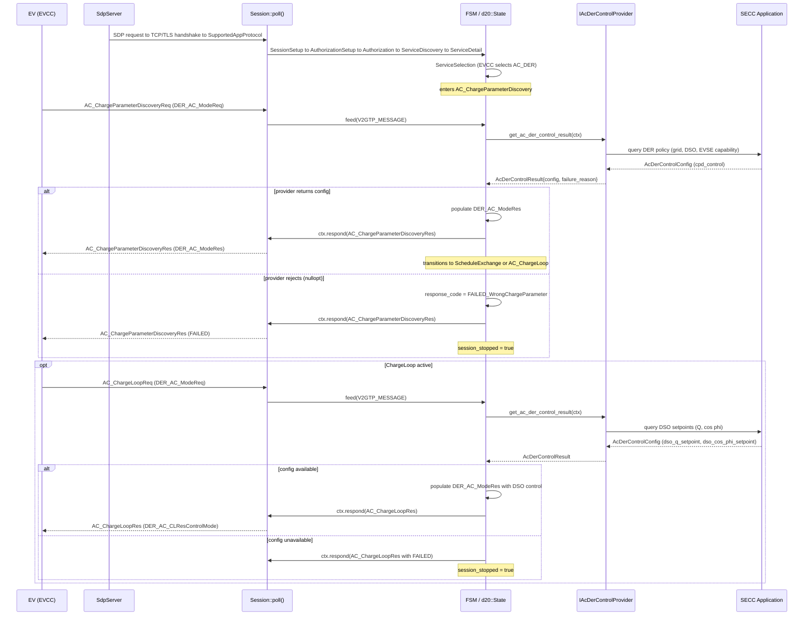

# AC DER SECC Provider Integration

`IAcDerControlProvider` is the SECC application-layer contract for ISO 15118-20 AMD1 AC_DER IEC control data.

## Control Flow (AC DER IEC)



## Overview
The standards-to-code matrix is maintained in `docs/ac_der_iec_traceability.md`.
The expert-review checklist is maintained in `docs/ac_der_iec_acceptance_pack.md`.

The protocol state machine owns message sequencing. The SECC application owns the DER policy:

- grid or DSO commands
- EVSE capability limits
- VoltWatt, FrequencyWatt, VoltVar, WattVar, and WattCosPhi policy values
- DSOQ and DSOCosPhi setpoints
- DC injection restriction
- fallback behavior when AC_DER is selected but policy data is unavailable

## API Contract

Implement:

```cpp
class MyAcDerControlProvider : public iso15118::d20::IAcDerControlProvider {
public:
    std::optional<iso15118::d20::AcDerControlConfig>
    get_ac_der_control_config(const iso15118::d20::AcDerControlContext& context) const override;
};
```

The provider receives the selected session context:

- `selected_energy_service`
- `selected_control_mode`
- `selected_mobility_needs_mode`
- `selected_der_control_functions`

The built-in SECC snapshot provider is intentionally scoped to the current production target:

- `selected_energy_service == AC_DER`
- `selected_control_mode == Dynamic`
- `selected_mobility_needs_mode == ProvidedByEvcc`
- all mandatory AC_DER IEC control functions negotiated and supported

Return `std::nullopt` when the current SECC application state cannot support AC_DER. When `AC_DER` is selected, this makes ChargeParameterDiscovery or ChargeLoop fail explicitly instead of silently sending incomplete DER data.

For the first production integration shape, the library also provides a snapshot adapter:

```cpp
auto snapshots = iso15118::d20::make_default_ac_der_secc_control_snapshots();
snapshots.grid_policy.volt_watt_start_voltage = ...;
snapshots.grid_policy.maximum_dc_injection = ...;
snapshots.dso_control.q_setpoint = ...;
snapshots.dso_control.cos_phi_setpoint = ...;

auto provider = iso15118::d20::make_secc_ac_der_control_provider(snapshots);
```

Applications can preflight the snapshots before session injection:

```cpp
const auto reason = iso15118::d20::validate_ac_der_secc_control_snapshots(snapshots);
if (reason != iso15118::d20::AcDerControlFailureReason::None) {
    // keep AC_DER disabled, refresh policy data, or report a SECC application fault
}
```

`make_default_ac_der_secc_control_snapshots()` is a generic, protocol-valid scaffold. It deliberately uses neutral
DSO values such as zero reactive-power setpoint, unity cos phi, and zero DC injection restriction so client policy is
not hidden in the default path.

Use `make_ac_der_iec_dynamic_eim_profile_snapshots()` only when the AC_DER_IEC Dynamic EIM demo/client profile is the
intended test input. Production SECC applications should replace both helpers with snapshots built from live or
validated application data.

Use `AcDerSeccControlSnapshots` as the boundary between the SECC application and the protocol stack:

- `AcDerGridPolicySnapshot`: VoltWatt, FrequencyWatt, and DC injection restriction values
- `AcDerDsoControlSnapshot`: DSOQ and DSOCosPhi setpoints
- `AcDerEvseCapabilitySnapshot`: supported AC_DER IEC control-function bitmap
- `AcDerRuntimeStateSnapshot`: AC_DER enablement and freshness gates

The adapter returns `std::nullopt` if the selected service is not AC_DER, the selected mode is outside the Dynamic
EVCC-provided scope, selected DER functions are missing, policy snapshots are invalid/stale, or the EVCC-selected
functions exceed EVSE capability. Use `get_ac_der_control_result()` when the application needs a precise
`AcDerControlFailureReason` for logs, telemetry, or diagnostics.

## Session Injection

Inject the provider through `EvseSetupConfig`:

```cpp
auto provider = std::make_shared<MyAcDerControlProvider>(...);
auto setup = iso15118::d20::EvseSetupConfig{...};
setup.ac_der_control_provider = provider;

auto session_config = iso15118::d20::SessionConfig(setup);
```

The provider is stored as `std::shared_ptr<const IAcDerControlProvider>`. It must remain valid for the full protocol session. Use immutable snapshots or internal synchronization if the provider reads live DSO, EVSE, or grid state.

## Runtime Behavior

- `AC_ChargeParameterDiscovery` asks the provider for `AcDerControlConfig` and uses `cpd_control`.
- `AC_ChargeLoop` asks the provider for `AcDerControlConfig` and uses `dso_q_setpoint` and `dso_cos_phi_setpoint`.
- `AC_BPT` and plain `AC` request paths do not consume AC_DER provider data.
- The built-in SECC snapshot provider rejects scheduled AC_DER and SECC-provided mobility-needs contexts until those
  scopes are implemented deliberately.
- `make_default_ac_der_control_config()` and `make_static_ac_der_control_provider()` are compatibility/demo helpers, not a production policy implementation.
- `make_default_ac_der_secc_control_snapshots()` is a neutral scaffold; it is not a client profile.
- `make_ac_der_iec_dynamic_eim_profile_snapshots()` is the explicit AC_DER_IEC Dynamic EIM demo/client profile seed.
- `make_secc_ac_der_control_provider()` is the preferred application-layer adapter for SECC integration tests and production-readiness demos.

## Compilable Example

See `examples/ac_der_secc_provider.cpp`.

With examples enabled:

```bash
cmake --build build-local-der --target example_ac_der_secc_provider
./build-local-der/examples/example_ac_der_secc_provider
```

## Production-Facing Adapter Example

See `examples/ac_der_secc_application_adapter.cpp` for a fuller SECC application-layer integration shape. It keeps
application concepts separate from protocol concepts:

- `GridCodePolicy`: VoltWatt, FrequencyWatt, and DC injection policy values
- `DsoControlCommand`: DSOQ and DSOCosPhi setpoints
- `EvseDerCapability`: supported AC_DER IEC control functions
- `RuntimeHealth`: enablement and freshness gates

The example translates those application inputs into `AcDerSeccControlSnapshots`, injects the provider into
`EvseSetupConfig`, and verifies that the provider accepts an `AC_DER` selected-service context while rejecting an
`AC_BPT` context.

```bash
cmake --build build-local-der --target example_ac_der_secc_application_adapter
./build-local-der/examples/example_ac_der_secc_application_adapter
```

## Readiness Gate

Run the AC_DER_IEC release-readiness gate before handoff or review:

```bash
tools/ac_der_iec_readiness.sh
```

By default it uses `build-pin-der`, builds the focused AC_DER_IEC tests and examples, runs the focused executables,
runs both demo examples, and then runs the full CTest suite. Override the build directory when needed:

```bash
BUILD_DIR=build-local-der tools/ac_der_iec_readiness.sh
```

For expert review handoff, print the acceptance pack index:

```bash
tools/ac_der_iec_acceptance_pack.sh
```

## Coverage Evidence

Generate focused AC_DER_IEC coverage evidence before production-readiness review:

```bash
tools/ac_der_iec_coverage.sh
```

The script runs the readiness gate first, then writes AC_DER_IEC-focused coverage reports under
`build-pin-der/ac_der_coverage/`:

- `ac_der_iec_coverage.txt`: text summary for review comments
- `ac_der_iec_coverage.xml`: Cobertura-compatible report for CI tools
- `ac_der_iec_coverage_summary.json`: machine-readable summary
- `html/index.html`: HTML summary report

By default, the focused AC_DER_IEC line-coverage gate is 70%. Override it only when a release branch has a documented
reason:

```bash
AC_DER_COVERAGE_MIN_LINE=75 BUILD_DIR=build-local-der tools/ac_der_iec_coverage.sh
```

When the local `gcovr` and `jinja2` versions support annotated source reports, enable the optional detailed HTML report:

```bash
AC_DER_COVERAGE_HTML_DETAILS=1 tools/ac_der_iec_coverage.sh
```
