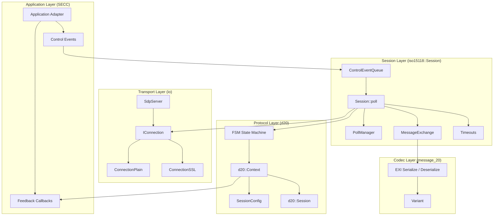
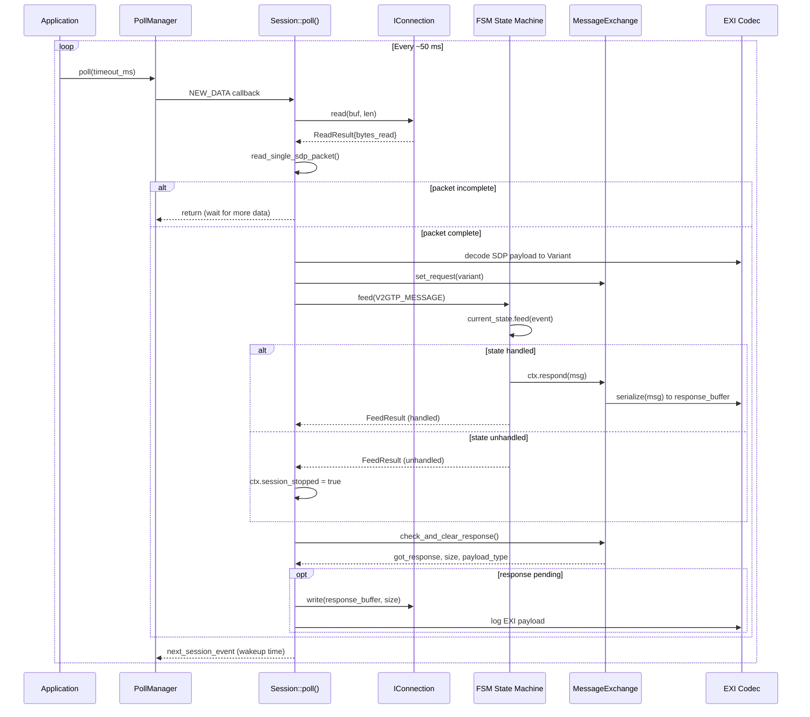
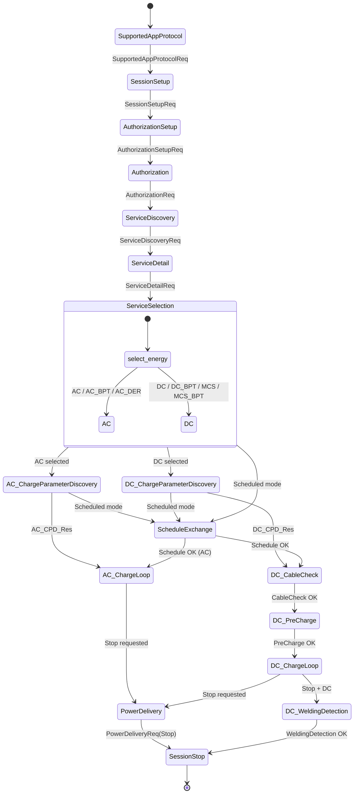

# libiso15118 Architecture

## Component Overview

## Event Loop Sequence

The core runtime loop. `PollManager` drives `Session::poll()`, which reads V2GTP packets,
feeds the FSM, serializes responses, and writes them back through the transport connection.

## State Machine Transitions (ISO 15118-20)

## AC DER IEC Control Flow

See [AC DER SECC Provider Integration](ac_der_secc_provider.md) for the detailed API contract and
a visual sequence diagram of the SECC to library interaction during AC_DER charge parameter negotiation
and charge-loop DSO control.
